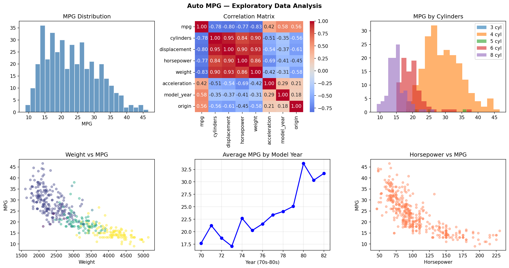
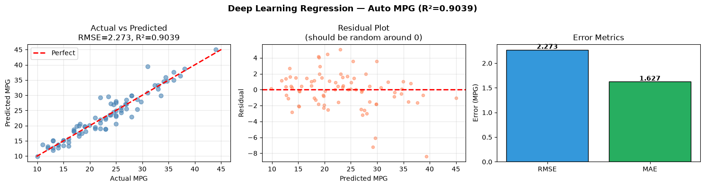

# 🚗 Automobile Fuel Efficiency Prediction (Deep Learning Regression)

An end-to-end **Deep Learning regression** project that predicts a car's fuel efficiency (**MPG — Miles Per Gallon**) from its technical specifications (cylinders, weight, horsepower, etc.).

This project walks through the **complete ML lifecycle** — from raw data to a deployment-ready model — using a Neural Network (MLP) built with **TensorFlow/Keras**.

---

## 📌 Project Overview

| | |
|---|---|
| **Task** | Regression (predicting a continuous number) |
| **Target** | `mpg` (Miles Per Gallon) |
| **Dataset** | [UCI Auto MPG Dataset](https://archive.ics.uci.edu/ml/datasets/auto+mpg) |
| **Model** | Multi-Layer Perceptron (MLP) Neural Network |
| **Metric** | RMSE, MAE, R² |
| **Tools** | Python, TensorFlow/Keras, scikit-learn, Pandas, Matplotlib, Seaborn |

**In simple words:** Give the model a car's specs (how many cylinders, how heavy it is, how powerful the engine is, etc.) and it predicts how many miles per gallon that car will get.

---

## 🗂️ Project Workflow (Step by Step)

The notebook is organized into **7 clear steps**, mimicking a real-world, production-style ML pipeline.

### Step 1 — Problem Definition & Data Loading
We start by clearly stating **what** we are solving:
- **Problem type:** Regression
- **Goal:** Predict MPG from car specifications
- **Evaluation metric:** RMSE (Root Mean Squared Error)

The data is loaded directly from the **UCI Machine Learning Repository** (`auto-mpg.data`). Since the dataset is fetched from a live URL, a **synthetic fallback dataset** is automatically generated if the internet/URL is unavailable — so the notebook never breaks due to a missing connection.

> 💡 **Why this matters:** Defining the problem and metric *before* touching the model keeps the whole project focused and prevents "solving the wrong problem."

---

### Step 2 — Exploratory Data Analysis (EDA)
Before building any model, we need to **understand the data**:
- Dropped the non-numeric `car_name` column (not useful for the model).
- Filled missing `horsepower` values with the **median** (robust to outliers).
- Printed descriptive statistics (mean, std, min, max) for every column.
- Calculated **correlation of every feature with MPG** to see which specs matter most (e.g., heavier cars → lower MPG).
- Plotted 6 visualizations in one figure:
  - MPG distribution
  - Correlation heatmap
  - Feature vs MPG scatter plots

> 💡 **Why this matters:** EDA reveals patterns (e.g., "weight and MPG are strongly negatively correlated"), catches data quality issues early, and guides feature engineering in the next step.



**What the EDA plots show:**
- **MPG Distribution** — most cars sit between 15–35 MPG, with a slight right skew.
- **Correlation Matrix** — `weight` (-0.83), `displacement` (-0.80), and `cylinders` (-0.78) have the strongest **negative** correlation with MPG (bigger/heavier engines = worse fuel efficiency), while `model_year` (+0.58) is **positively** correlated (newer cars are more efficient).
- **MPG by Cylinders** — 4-cylinder cars dominate the higher-MPG range; 8-cylinder cars cluster at the low-MPG end.
- **Weight vs MPG** — a clear downward trend: heavier cars get fewer miles per gallon.
- **Average MPG by Model Year** — a strong upward trend from 1970 to 1982, reflecting real-world fuel-efficiency improvements over that decade.
- **Horsepower vs MPG** — another clear negative relationship: more horsepower generally means lower MPG.

---

### Step 3 — Feature Engineering
Raw features are useful, but **engineered features** often make the model smarter. Three new features were created:

| New Feature | Formula | Intuition |
|---|---|---|
| `power_to_weight` | `horsepower / weight` | A lighter, more powerful car behaves differently than a heavy, weak one |
| `displacement_per_cyl` | `displacement / cylinders` | Normalizes engine size per cylinder |
| `is_american` | `1 if origin == 1 else 0` | Captures regional manufacturing differences |

**Data splitting (train / validation / test):**
Since `train_test_split` only splits data into 2 parts at a time, it's called **twice** to get 3 sets:
1. **Test set (20%)** — set aside and never touched until the final evaluation (Step 6).
2. **Validation set (~12%)** and **Training set (~68%)** — split from the remaining 80%, used for training and tuning.

**Feature scaling:**
`StandardScaler` is **fit only on the training set**, then applied to validation/test. This avoids **data leakage** (letting the model "peek" at test data statistics before evaluation).

> 💡 **Why this matters:** Good features can improve model performance more than a fancier architecture. Proper train/val/test separation ensures the reported performance is trustworthy, not overly optimistic.

---

### Step 4 — Hyperparameter Search
Instead of guessing one architecture, **5 different model configurations** are tried (varying number of layers, neurons, dropout rate, and learning rate):

```python
param_grid = [
    {'units': (64, 32),      'dropout': (0.1, 0.0), 'lr': 0.001},
    {'units': (128, 64),     'dropout': (0.2, 0.1), 'lr': 0.001},
    {'units': (128, 64, 32), 'dropout': (0.2, 0.1), 'lr': 0.001},
    {'units': (128, 64, 32), 'dropout': (0.3, 0.2), 'lr': 0.0005},
    {'units': (256, 128),    'dropout': (0.3, 0.2), 'lr': 0.001},
]
```

Each configuration is trained for a short budget (150 epochs, early stopping) and evaluated on the **validation set only**. The configuration with the **lowest validation RMSE** is selected as the winner.

> 💡 **Why this matters:** This is a simplified, transparent version of tools like `GridSearchCV`, `KerasTuner`, or `Optuna`. Selecting based on validation (not test) performance keeps the test set "clean" for a fair, final check in Step 6.

---

### Step 5 — Final Model Training (Best Hyperparameters)
The **winning configuration** from Step 4 is now trained properly and thoroughly:
- **Batch Normalization** and **L2 regularization** are added (skipped earlier for speed, now used to prevent overfitting).
- Trained for up to **500 epochs**, with:
  - **EarlyStopping** — stops training if validation loss doesn't improve (patience = 30 epochs), and restores the best weights.
  - **ReduceLROnPlateau** — automatically lowers the learning rate if progress stalls.
- Finally, predictions are made on the **test set** (touched here for the very first time), and the final metrics are reported:
  - **RMSE** (Root Mean Squared Error)
  - **MAE** (Mean Absolute Error)
  - **R²** (how much variance in MPG the model explains)

> 💡 **Why this matters:** This mirrors real-world practice — a fast search phase to pick a good architecture, followed by a full, careful training run with proper regularization for the final product.

---

### Step 6 — Evaluation & Visualization
Three diagnostic plots are generated to visually judge the model's quality:
1. **Actual vs Predicted MPG** — points should lie close to the diagonal "perfect prediction" line.
2. **Residual Plot** — errors should scatter randomly around zero, with no visible pattern (a pattern would mean the model is missing something).
3. **Training Curves** — training vs validation loss over epochs, to confirm the model learned well without overfitting.

The chart is saved as `model_evaluation_results.png`.

> 💡 **Why this matters:** Numbers alone (RMSE, R²) don't tell the whole story — visual diagnostics reveal *how* and *where* the model succeeds or struggles.

---

### Step 7 — Deployment-Ready Packaging
The final step packages everything needed to use this model in a **real application** (e.g., a web API):

1. **Save the scaler** (`scaler.pkl`) — inference must reuse the *exact* training-time scaling; refitting it on new data would silently break predictions.
2. **Save the trained model** (`mpg_mlp_model.keras`).
3. **Save metadata** (`metadata.json`) — feature list, engineered feature formulas, best hyperparameters, and final test metrics — so future retrains have a documented baseline.
4. A **`predict_mpg()` function** is provided — it takes raw car specs (not pre-engineered features), automatically recreates the engineered features, scales them, and returns a single MPG prediction. This is exactly the function a **FastAPI/Flask** endpoint would call.

A **deployment checklist** is also included as a reminder for production use:
- Validate raw inputs before prediction
- Always reload the saved scaler/model — never refit
- Log predictions for drift monitoring
- Pin library versions to match the training environment

> 💡 **Why this matters:** A model is only useful once it can be reliably used outside the notebook. This step turns a "notebook experiment" into something deployable.

---

## 🛠️ Tech Stack
- **Python 3**
- **Pandas / NumPy** — data handling
- **Matplotlib / Seaborn** — visualization
- **scikit-learn** — preprocessing, train/test split, metrics
- **TensorFlow / Keras** — deep learning model (falls back to `MLPRegressor` if TensorFlow isn't available)
- **Joblib** — saving/loading the scaler and model

---

## 📁 Project Structure
```
├── DL-End-to-End-Regression-Project.ipynb   # Main notebook (all 7 steps)
├── eda_visualizations.png                   # Saved EDA plots (Step 2)
├── model_evaluation_results.png             # Saved evaluation plots (Step 6)
└── dl19_mpg_deployment/                     # Deployment artifacts (Step 7)
    ├── scaler.pkl                           # Fitted StandardScaler
    ├── mpg_mlp_model.keras                  # Trained neural network
    └── metadata.json                        # Features, hyperparameters, metrics
```

---

## ▶️ How to Run
1. Clone this repository.
2. Install dependencies:
   ```bash
   pip install numpy pandas matplotlib seaborn scikit-learn tensorflow joblib
   ```
3. Open the notebook:
   ```bash
   jupyter notebook DL-End-to-End-Regression-Project.ipynb
   ```
4. Run all cells from top to bottom.

---

## 📊 Results

**Final Test Set Performance:**

| Metric | Value | Meaning |
|---|---|---|
| **RMSE** | 2.360 MPG | On average, predictions are off by ~2.36 MPG |
| **R²** | 0.8964 | The model explains ~90% of the variation in MPG |
| **Training length** | 101 epochs | Early stopping kicked in once validation loss stopped improving |



**What the results plots show:**
- **Actual vs Predicted** — points cluster tightly around the red "Perfect" diagonal line, confirming strong prediction accuracy across the full MPG range (10–45).
- **Residual Plot** — errors are scattered randomly around 0 with no obvious pattern or trend, which means the model isn't systematically over- or under-predicting for any particular MPG range — a healthy sign for a regression model.
- **Training Curves** — training and validation MSE loss drop together and converge smoothly by ~epoch 40–50, with no divergence afterward — meaning the model learned well **without overfitting**.

Together, these confirm the final MLP model generalizes well to unseen data, not just the training set.

---

## 🎯 Key Takeaways
- Followed a **complete, leak-free ML pipeline**: EDA → feature engineering → proper train/val/test split → hyperparameter search → final training → evaluation → deployment packaging.
- Used **validation data only** for model selection, keeping the **test set untouched** until the final, single evaluation — a core best practice for trustworthy results.
- Delivered a **deployment-ready package** (model + scaler + metadata + inference function), not just a trained model sitting in a notebook.
